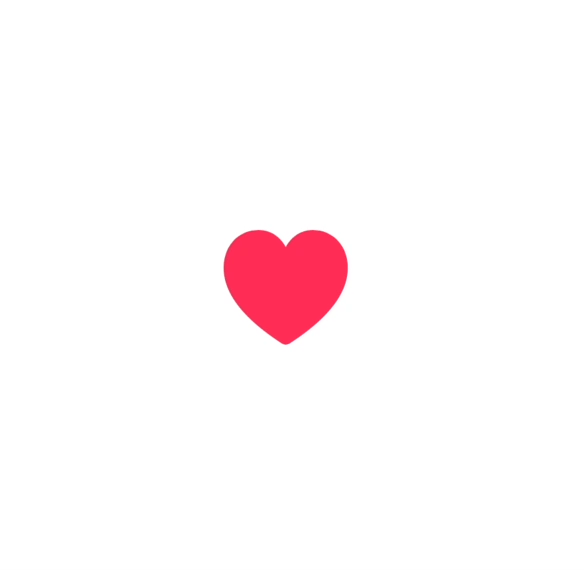

# 🌀 swiftui-micro-animations

A growing collection of fun, smooth, minimal **SwiftUI animations** — made for indie devs, side projects, and UI polish lovers.

<h3>🚀 Animation Previews</h3>

<table align="center">
  <tr>
    <td align="center"><b>Pulse Button</b></td>
    <td align="center"><b>Card Flip</b></td>
    <td align="center"><b>Bouncy Tab Bar</b></td>
  </tr>
  <tr>
    <td></td>
    <td></td>
    <td></td>
  </tr>
</table>

<br/>

<table align="center">
  <tr>
    <td align="center"><b>Loading Wave (Dot Bounce)</b></td>
    <td align="center"><b>Loading Wave (Vertical Bars)</b></td>
    <td align="center"><b>Loading Wave (Fade)</b></td>
    <td align="center"><b>Heart Beat</b></td>
  </tr>
  <tr>
    <td></td>
    <td></td>
    <td></td>
    <td></td>
  </tr>
</table>


---

## 🧠 Why?

Micro-animations bring ✨ emotion to interfaces.
They’re lightweight, elegant, and delightful 😌.
They turn “this works” ✅ into “this feels amazing” 💥.

---

## 🔧 Tech Notes

- Built in **SwiftUI 5**
- Compatible with **iOS 17+**
- Preview GIFs included in `/Previews`

---

This project is part of my **My Dev Diaries** journey — documenting, sharing, and shipping indie projects in public.  
I also launched 👉 [100 iOS App Ideas with MVP Scopes](https://heeydurh.gumroad.com/l/hwfkko) — if you need a new project to build, start there.

---

## 📬 Suggestions?

PRs welcome; got a cool micro-animation idea? Open an issue or reach out:

→ Message me: [github.com/yourhandle](https://github.com/yourhandle) 

→ Or just fork it, remix it, and go ship something cool.

---

## ✨ Animations Included

- ✅ Card Flip  
- ✅ Bouncy Tab Bar Icon
- ✅ Heart Beat
- ✅ Loading Wave  
- ✅ Pulse Button  

More coming soon...

---

## 📦 Usage

Each animation is a self-contained SwiftUI view — ready to drop into your own app or tweak for your needs.

\
Pulse Button
```swift
PulseButton(action: {
    // Your tap action
})
```
\
Card Flip
```swift
CardFlip {
    VStack {
        Text("Front")
             .font(.title)
             .foregroundColor(.white)
         }
         .frame(maxWidth: .infinity, maxHeight: .infinity)
         .background(Color.blue)
    } back: {
        VStack {
            Text("Back")
                .font(.title)
                .foregroundColor(.white)
            }
            .frame(maxWidth: .infinity, maxHeight: .infinity)
            .background(Color.green)
    }
```
\
Bouncy Tab Bar Button
```swift
   BouncyTabBarButton(
        icon: "house.fill",
        label: "Home",
        isSelected: true
    ) {
        print("Home Tapped")
    }
```
\
Heartbeat
```swift
 heartbeatView {
     Image(systemName: "heart.fill")
        .font(.system(size: 64))
        .foregroundColor(.pink)
    }
```

\
Loading Wave - Dot Bounce
```swift
DotBounceLoadingWave()
```

\
Loading Wave - Vertical Bars
```swift
 BarSlideLoadingWave(barCount: 6, color: .orange)
```

\
Loading Wave - Fade
```swift
 BarFadeLoadingWave(barCount: 4, size: 10, color: .purple, speed: 0.3)
```
